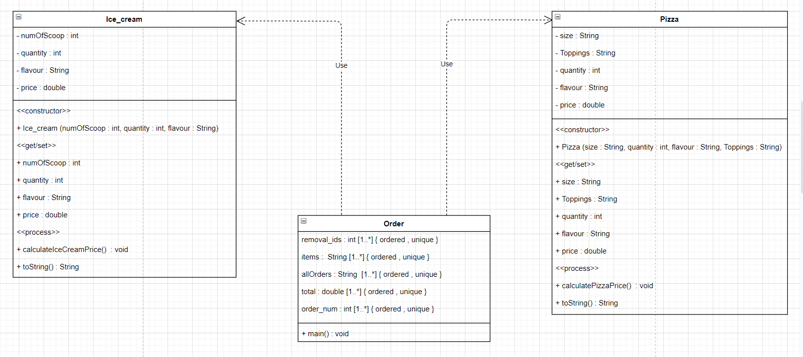
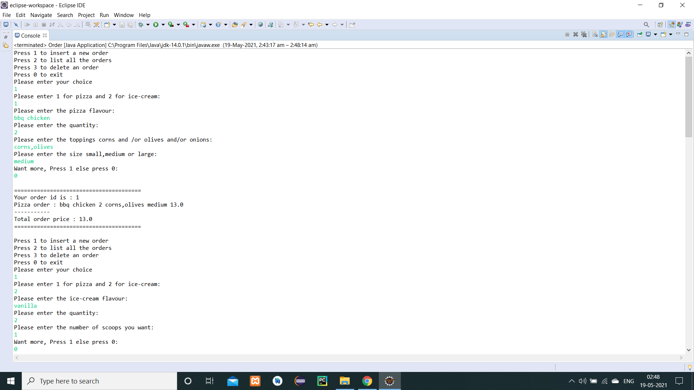
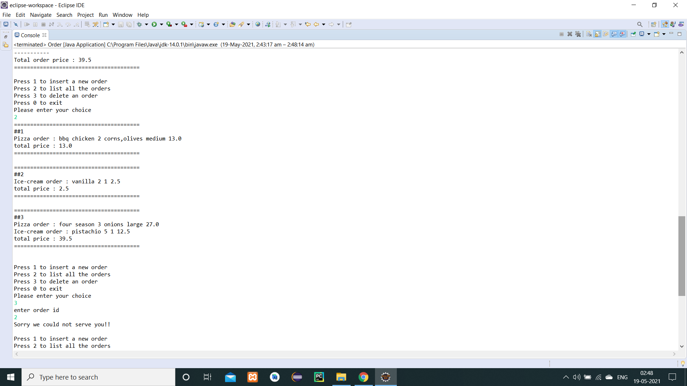
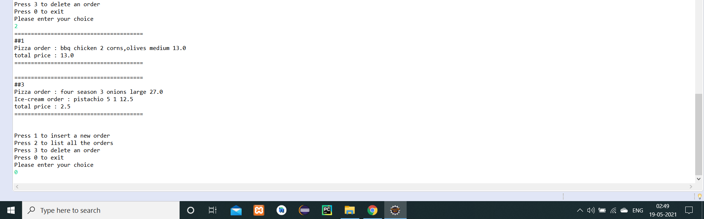

## Table of contents:

* [Description](#D)

* [Working](#W)

* [Class diagram](#C)

* [Output](#O)

 

## Description

I made this project to understand the working of ArrayLists. It basically serves the following functions:

* insert new orders related to:
  * Pizza
  * Ice-cream
* list all the orders
* delete an order

 

## Working

### Order class

* The program starts with asking the user to make a choice among insertion, deletion and display of orders.
* If user wants to insert:
  * System asks to make a choice between pizza and Ice-cream
  * If user selects pizza then:
    * User is asked to enter the flavour, quantity, toppings [1...*] and size
    * A Pizza object is created to call the setters of Pizza class, values are set
    * Then price is calculated
    * This pizza order is added to the ArrayList where details have been fetched rom the toString() of Pizza class
  * If the user selects ice-cream
    * User is asked to enter the flavour, quantity, number of scoops
    * An Ice_cream object is created to call the setters of Ice_cream class, values are set
    * Then price is calculated
    * This ice_cream order is added to the ArrayList where details have been fetched rom the toString() of Ice_cream class
  * User is asked if he wants to continue with the orders to buy more stuff, if yes process continues.
  * If not, then all the orders of the specific user is accumulated in 1 ArrayList called allOrders.
  * An id is assigned to this order which will help during deletion. 
  * Order and the total price of all his ordered items is displayed to the user to have one last look.
  * And the main menu is re-displayed again for next customer
* If the user wants to delete:
  * User is asked to enter his order_id which is then saved into another ArrayList called removal_id
  * An apology message is displayed
* If the admin selects to get a list of all orders then:
  * All the details of orders will be shown except those whose ids are in removal_id list.

### Pizza class

* This class focuses on calculating the total price of a pizza order
* Algorithm to calculate price:
  * Depending upon the flavour, size chosen:
  * price = quantity*(Flavour_price+(0.5*count_no_of_toppings)+price_of_size)

### Ice_cream class

* This class focuses on calculating the total price of a ice-cream order
* Algorithm to calculate price:
  * Depending upon the flavour chosen:
  * price = quantity*(flavour_price + (0.5 * number of scoops))
 

 

## Class diagram

 

## Output

